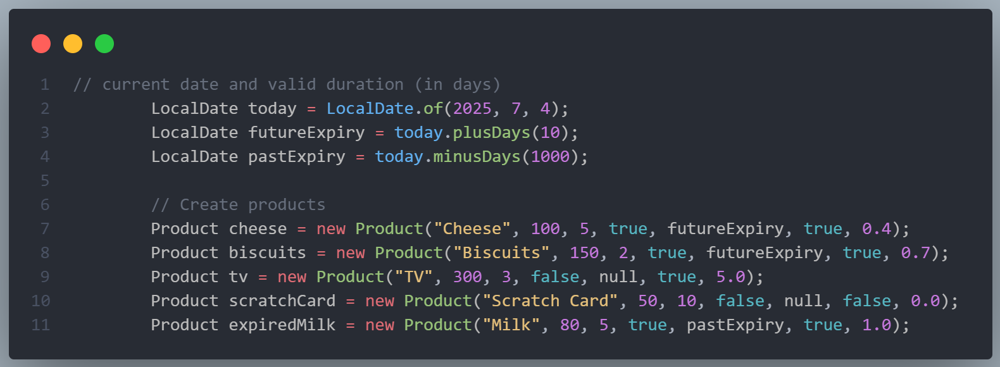
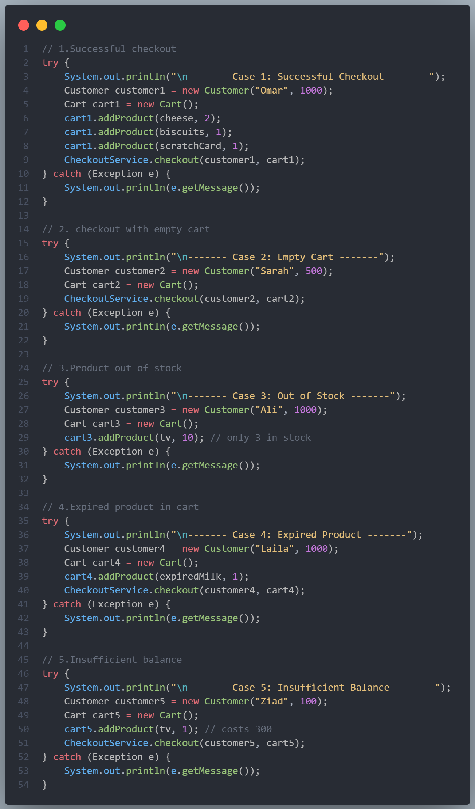
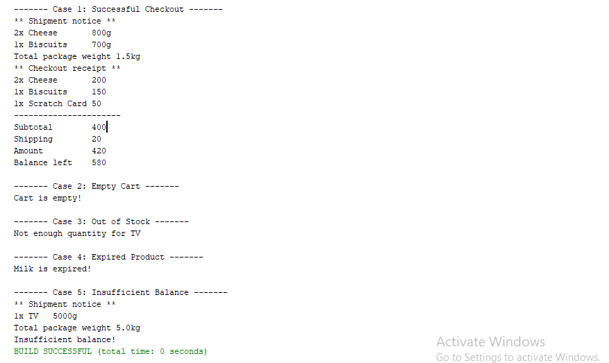

# E-Commerce Console Application

A simple Java-based console application simulating a basic e-commerce system.  
This project was created to demonstrate object-oriented design, exception handling, and real-world logic such as product expiration, cart validation, and shipping weight calculation.

## 🖼️ Screenshots

### 1. Product Creation

---

### 2. Use Case Testing

---

### 3. Console Output

